# REST Assured API Automation from scratch + Framework + CI

* This repo contains the code snippets following
  the [Udemy course](https://www.udemy.com/course/rest-assured-api-automation/) created by Omparkash Chavan.
* It also includes the extended practice exercises and enhancement to the original framework developed during the
  course.
* [REST Assured wiki](https://github.com/rest-assured/rest-assured/wiki/Usage)

---

## Learning Outcomes

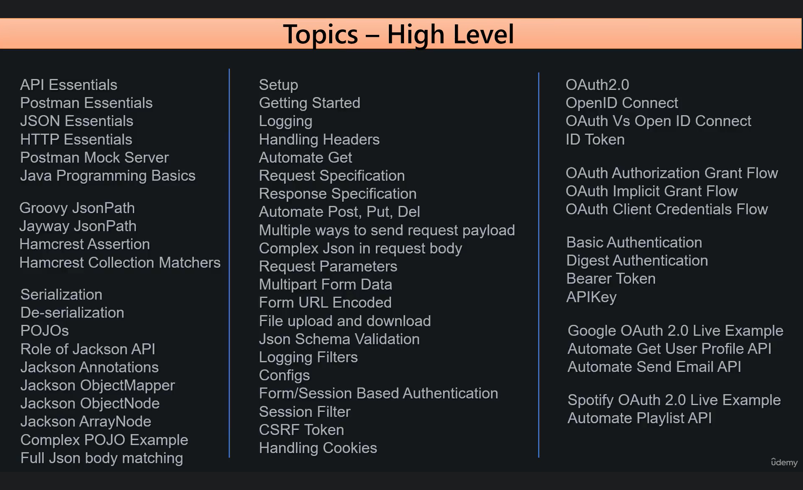

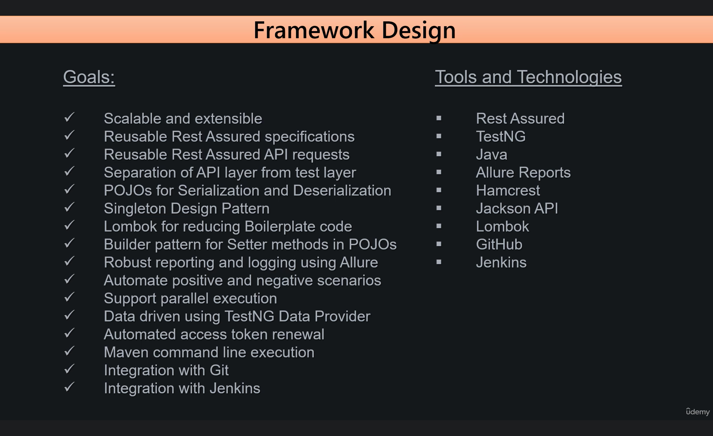

## Demo Websites

* https://reqres.in/
* https://httpbin.org/
* http://dummy.restapiexample.com/
* https://jsonplaceholder.typicode.com/
* https://randomuser.me/

## Postman Essentials

* Create a new collection and a new test environment.
* Setup `baseUrl` https://api.postman.com as a variable in the test environment and link this environment to the newly
  created collection.
* Now the endpoint can be written as: {{baseUrl}}/workspaces
* Generate API Key:
    * Click on the profile icon in Postman APP and then Settings.
    * It will open up the browser. Click on the API keys section and then `+ Generate API Key`
    * Note the API key somewhere safe as Postman will mask it later.
    * Save this key as an environment variable
    * [Using your Postman API key](https://learning.postman.com/docs/developer/postman-api/authentication/#generate-a-postman-api-key)
* [Postman API overview](https://learning.postman.com/docs/developer/postman-api/intro-api/)
* [Postman API Documentation](https://www.postman.com/postman/workspace/postman-public-workspace/documentation/12959542-c8142d51-e97c-46b6-bd77-52bb66712c9a)
* Navigate to Postman API -> Workspaces -> Get all workspaces, and read the documentation

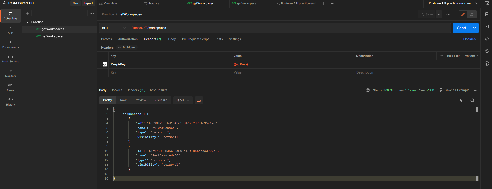

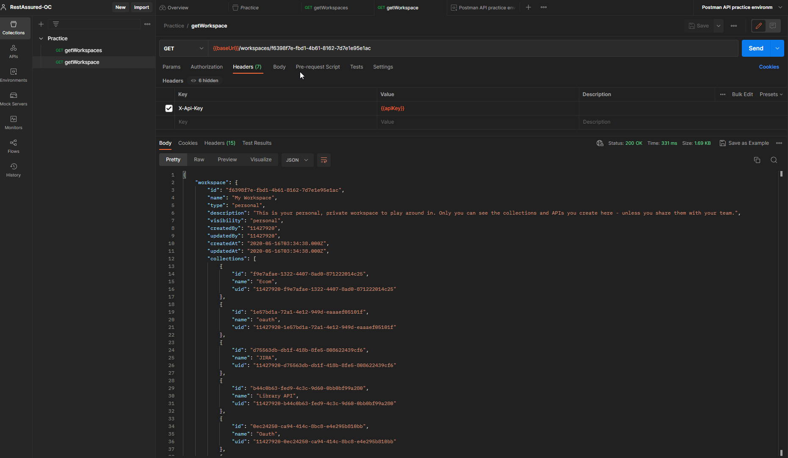

---

## JSON Essentials

* [JSON Path Finder](https://jsonpathfinder.com/)
* [JSONPath Online Evaluator - jsonpath.com](https://jsonpath.com/)
* [JSON (using JsonPath)](https://github.com/rest-assured/rest-assured/wiki/Usage#json-using-jsonpath)
* JsonPath uses Groovy's GPath syntax. [Groovy JSON](https://groovy-lang.org/json.html)
* GPath is a path expression language integrated into Groovy which allows parts of nested structured data to be
  identified.
* [GPath](https://docs.groovy-lang.org/latest/html/documentation/core-semantics.html#gpath_expressions) use a dot-object
  notation to perform object navigation.
* Groovy Playground
    * http://groovyconsole.appspot.com/
    * https://www.jdoodle.com/execute-groovy-online/
    * https://onecompiler.com/groovy

```json
{
  "firstName": "Larry",
  "lastName": "Sheen",
  "age": 30,
  "children": [],
  "spouse": null,
  "vehicle": true,
  "address": {
    "street": "6301 Richardson Drive",
    "city": "New York City",
    "state": "New York",
    "zipCode": "65027"
  },
  "phoneNumbers": [
    {
      "type": "mobile",
      "number": "543 666-6794"
    },
    {
      "type": "home",
      "number": "555 650-2200"
    }
  ]
}
```

```groovy
import groovy.json.JsonSlurper

def object = new JsonSlurper().parseText(
        '''
{INSERT_YOUR_JSON_HERE}
'''
)

def query = object
println query
```

* Following paths can be constructed to retrieve the data:
    * **Street Address** `object.address.street`
    * **First phone number** `object.phoneNumbers[0].number`
    * **All phone numbers as array** `object.phoneNumbers.number`

* [Jayway JsonPath](https://github.com/json-path/JsonPath)
* RestAssured uses Groovy JsonPath syntax by default. For using Jayway JsonPath, it has to be added as a dependency.
* Both implementations are different syntax-wise. For example, to extract all the phone numbers from sample JSON:
    * Groovy syntax: `phoneNumbers.number`
    * Jayway syntax: `$.phoneNumbers..number`

---

## HTTP Essentials

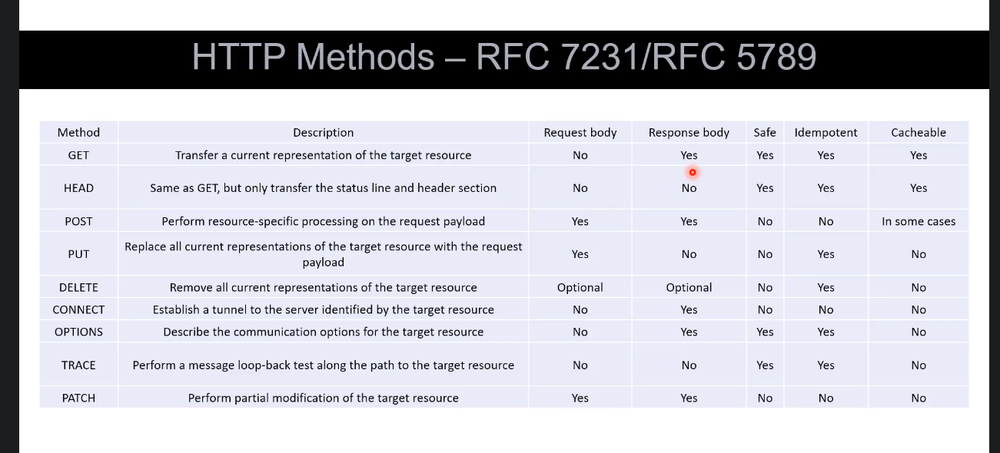

---

## Postman Mock Server

* Mock server is useful when backend APIs are not completely ready therefore developers can develop the frontend with
  the help of API specifications.
* Create a new mock collection and add a mock server. Use the Url of the mock server and create an example response for
  the APIs to automate.
* Mock server can also be executed from the browser and it will return the same response as in Postman.
* Use the `x-mock-response-code` header with different status codes to test different status codes for examples.

---

## REST Assured

[REST-assured official website](https://rest-assured.io/)
[REST Assured Usage Wiki](https://github.com/rest-assured/rest-assured/wiki/Usage)

### Setup

#### Pre-requisites

* Java JDK 17
* TestNG
* IDE - Intellij
* Maven

> JSONPath and XMLPath are added as transitive dependencies automatically when rest-assured is added.

> Intellij Tip! Use the shortcut Ctrl+alt+shift+v to paste the code without auto-formatting. Hence it keeps the
> formatting of the copied code.

* [Static Imports](https://github.com/rest-assured/rest-assured/wiki/Usage#static-imports)
* In order to use REST assured effectively it's recommended to statically import methods from the following classes:

```java
import static io.restassured.RestAssured.*
import static io.restassured.matcher.RestAssuredMatchers.*
import static org.hamcrest.Matchers.*
```

* Example Test Case to verify if dependencies are copnfigired properly:

```java
import org.testng.annotations.Test;

import static io.restassured.RestAssured.*;
import static io.restassured.matcher.RestAssuredMatchers.*;
import static org.hamcrest.Matchers.*;

public class HelloWorldTest {

    @Test
    public void example_test() {
        given().when().then();
    }
}
```

### Getting Started

#### Static Imports

* With Static imports, we do not have to use the Class name together with the method name to use it e.g. `given()`
  method comes from RestAssured class.
* The disadvantage of static imports is we do not get to know what all methods come with the class as the Intellij
  suggests the methods when the Class name is followed by dot.
* The difference can be seen by the example code in `NonStaticImports` and `StaticImports` classes in Practice package.

#### Method Chaining

* also known as builder pattern.
* `given()` method returns `RequestSpecification` interface which has definitions for most of the methods.
* All these methods return an object of the same class that implements the `RequestSpecification` interface. Since all
  the methods return the same object, it is possible to chain them.
* The concept is further explained in the `MethodChaining` class in Practice package.
* Since all the methods in the class return the object of the same class, so these methods can be chained together.
  Similar concept is implemented by REST assured.

#### Automate GET Request

* All the information that needs to be sent as a part of the request such as path parameters, query parameters, headers,
  authorization, and request body etc are to be included in `given()` method.
* `when()` represents the action that is going to take place such as execute HTTP request methods like GET POST etc on a
  given URL.
* `then()` represents the outcome of the event that got executed in `when()`. The output can be validated in `then()`
  such as response code, headers body, cookie.
* `AutomateGet` class in the Practice package has the example of Postman API for automating workspaces endpoint.
* The response can be extracted with `extract()` method and save it as an object of `Response` class. Response can be
  converted to string with `asString()`method.
* Following code snipped shows multiple ways to extract the single field from `Response res` object:

```java
        //first way
        System.out.println("Workspace name = "+JsonPath.from(res.asString()).getString("workspaces[0].name"));

                //second way
                System.out.println("Workspace name = "+res.path("workspaces[0].name"));

                //third way
                JsonPath jpath=new JsonPath(res.asString());
                System.out.println("Workspace name = "+jpath.getString("workspaces[0].name"));
```

#### Hamcrest Assertion on Extracted response

* `import static org.hamcrest.MatcherAssert.assertThat;` and assert with hamcrest `assertThat()` method.

```java
        //Hamcrest assertion
        assertThat(name,equalTo("My Workspace"));

                //TestNG assertion
                Assert.assertEquals(name,"My Workspace");
```

#### What is Hamcrest

* Hamcrest is a well known assertion library used for unit testing along with JUnit.
* Hamcrest can be used along with Rest Assured for assertions.
* Uses matcher classes for making assertions
* [Hamcrest Matcher Interface Documentation](https://hamcrest.org/JavaHamcrest/javadoc/2.2/)

##### Advantages

* Human readable and in plain english
* Code is neat and intuitive
* Provides thin methods like "is" and "not", also called as decorators, for more readibility

##### Hamcrest vs TestNG

* Readability
* Descriptive error messages
* Type Safety

#### Hamcrest Collection Matchers

##### Collection matchers (List, Array, Map, etc.)

* hasItem() -> check single element in a collection
* not(hasItem()) -> check single element is NOT in a collection
* hasItems() -> Check all elements are in a collection
* contains() -> Check all elements are in a collection and in a strict order
* containsInAnyOrder() -> Check all elements are in a collection and in any order
* empty() -> Check if collection is empty
* not(emptyArray()) -> Check if the Array is not empty
* hasSize() -> Check size of a collection
* everyItem(startsWith()) -> Check if every item in a collection starts with specified string
* hasKey() -> Map -> Check if Map has the specified key [value is not checked]
* hasValue() -> Map -> Check if Map has at least one key matching specified value
* hasEntry() -> Maps -> Check if Map has the specified key value pair
* equalTo(Collections.EMPTY_MAP) -> Maps [Check if empty]
* allOf() -> Matches if all matchers matches
* anyOf() -> Matches if any of the matchers matches

##### Numbers:

* greaterThanOrEqualTo()
* lessThan()
* lessThanOrEqualTo()

##### String:

* containsString()
* emptyString()

* The matchers usage is demonstrated in the methods `validate_response_body_hamcrest_learnings()`
  and `validate_response_body()` in the `AutomateGet` class in the Practice package.

### Logging

* [REST Assured logging documentation](https://github.com/rest-assured/rest-assured/wiki/Usage#logging)
* The `Logging` class in the practice package demonstrates the different logging methods with example test cases.

**Request Logging**

```java
given().log().all()... // Log all request specification details including parameters, headers and body
        given().log().params()... // Log only the parameters of the request
        given().log().body()... // Log only the request body
        given().log().headers()... // Log only the request headers
        given().log().cookies()... // Log only the request cookies
        given().log().method()... // Log only the request method
        given().log().path()... // Log only the request path
```

**Response Logging**

```java
get("/x").then().log().statusLine()... // Only log the status line
        get("/x").then().log().headers()... // Only log the response headers
        get("/x").then().log().cookies()... // Only log the response cookies
```

* If you're only interested in printing the response body if an error occur then you can use:

```java
get("/x").then().log().ifError()...
```

* If you want to print the response body regardless of the status code you can do:

```java
get("/x").then().log().body()..
```

**Log if validation fails**

* Since REST Assured 2.3.1 you can log the request or response only if the validation fails. To log the request do:

```java
given().log().ifValidationFails()...

        ...then().log().ifValidationFails()...
```

* It's also possible to enable this for both the request and the response at the same time using the LogConfig:

```java
given().config(RestAssured.config().logConfig(logConfig().enableLoggingOfRequestAndResponseIfValidationFails(HEADERS)))...
```

* This will log only the headers if validation fails.

**Blacklist Headers from Logging**

* As of REST Assured 4.2.0 it's possible to blacklist headers so that they are not shown in the request or response log.
  Instead the header value will be replaced with [ BLACKLISTED ]. You can enable this per header basis using the
  LogConfig:

```java
given().config(config().logConfig(logConfig().blacklistHeader("Accept")))...
```

### Handling Headers

* Headers consist of meta-data that are sent along with a request and response.
* `AutomateHeaders` class contains the example code snippets for demonstrating various headers methods in REST Assured.

##### Set Mock Environment for Headers

* copy the Url of the Mock Server from created mock collection.
* create the mock examples `headerValue1` and `headerValue2` and add the headers `responseHeader`
  and `Content-Type: application/json` and body message information in examples.
* `x-mock-match-request-headers` request header should contain the name of the header in examples so the server can
  decide which response to return based on this header value.
* Server will return the response header and body according to the request header.
*

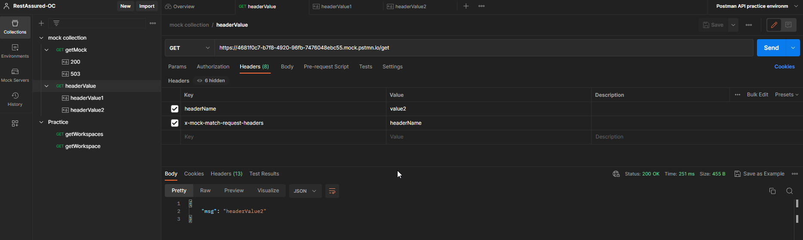
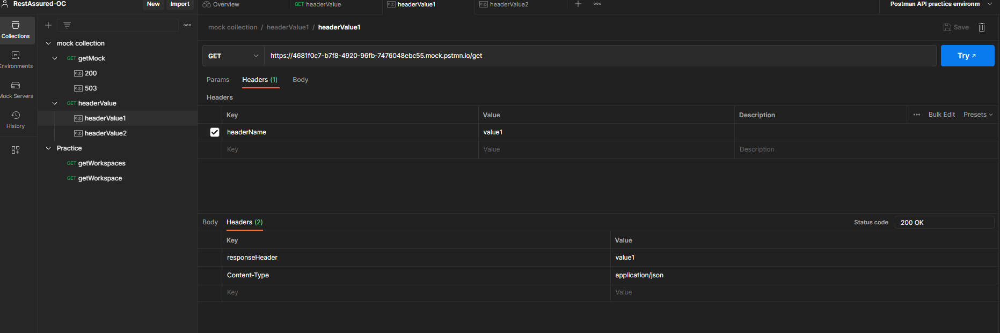

```java
        Header header=new Header("headerName","value1");
        Header matchHeader=new Header("x-mock-match-request-headers","headerName");
        given().
            baseUri(BASEURI).
            header(header).
            header(matchHeader).
        when().
```

##### Multiple Headers in Request - Using Headers

* The disadvantage of the above approach is that for many headers, the `header()` method has to be repeated many times.
* We can use the `Headers` object and `headers()` method provided by REST Assured to group the headers and pass
  together.

```java
        Header header=new Header("headerName","value1");
        Header matchHeader=new Header("x-mock-match-request-headers","headerName");

        Headers headers=new Headers(header,matchHeader);
        given().
        baseUri(BASEURI).
        headers(headers).
```

##### Multiple Headers in Request - Using Map

* Alternatively, we can create the map of headers as key-value pairs strings and pass it directly to `headers()` method.
* `headers()` method is overloaded and it can accept map as well as Headers object.

```java
        HashMap<String, String> headers=new HashMap<String, String>();
        headers.put("headerName","value1");
        headers.put("x-mock-match-request-headers","headerName");

        given().
        baseUri(BASEURI).
        headers(headers).
```

##### Multi Value Header

* [Multi value parameters](https://github.com/rest-assured/rest-assured/wiki/Usage#multi-value-parameter)
* Multi-value headers can be passed either directly to headers() method or with `Headers` object and passing
  multiple `Header` object key-value pairs to it.

```java
        Header header1=new Header("multiValueHeader","value1");
        Header header2=new Header("multiValueHeader","value2");

        Headers headers=new Headers(header1,header2);

        given().
        baseUri(BASEURI).
        headers(headers).
```

* Response header can also be validated by putting inside `header()` method after `then()`. You can assert for multiple
  headers in the same call to `headers()` also.
* If you need to perform further operations on header, then you can `extract().headers()` method and save it
  as `Headers` object.
* you can use the `Headers.getValues()` method to extract the multi value header in a list.

### Request Specification

* All the code snippets for this section are implemented under `RequestSpecificationExample.java` class in Practice
  package.
* RequestSpecification can be used to write test cases in style other than BDD.
* `given()` method returns the reference of the interface `RequestSpecification`.
* So what is happening is when we say that the given method returns, the reference of the interface, it is indirectly
  returning the object of the class that implements the interface. So basically the object of the class that implements
  all the abstract methods that are available in the interface. So basically, once we get the object of the class, it
  means we get access to the implemented methods.

```java
        RequestSpecification requestSpecification=given()
            .baseUri(BASEURI)
            .header("X-Api-Key",API_KEY)
        ;

        given()
            .spec(requestSpecification).
        when()
            .get("/workspaces")
        .then()
            .log().all()
            .assertThat().statusCode(200)
        ;
```

* you can also use `with()` method instead of `given()` method as there is no difference functionality wise.
* To reuse the requestSpecification object, create a class variable and initialize the requestSpecification in TestNG
  BeforeClass hook.

```java
    RequestSpecification requestSpecification;

@BeforeClass
public void beforeClass(){
        requestSpecification = with()
        .baseUri(BASEURI)
        .header("X-Api-Key",API_KEY);
        }

@Test
public void validate_status_code(){
        given()
            .spec(requestSpecification).
        when()
            .get("/workspaces")
        .then()
            .log().all()
            .assertThat().statusCode(200)
        ;
        }
```

* Now we can start to convert our test cases from BDD to non-BDD style.

```java
    RequestSpecification requestSpecification;

@BeforeClass
public void beforeClass(){
        requestSpecification = with()
            .baseUri(BASEURI)
            .header("X-Api-Key",API_KEY)
            .log().all()
        ;
        }

@Test
public void validate_status_code(){
        Response response=requestSpecification.get("/workspaces").then().log().all().extract().response();
        assertThat(response.statusCode(),is(equalTo(200)));
        }

@Test
public void validate_response_body(){
        Response response=requestSpecification.get("/workspaces").then().log().all().extract().response();
        assertThat(response.path("workspaces[0].name").toString(),equalTo("My Workspace"));
        }
```

* Rest Assured provides us an alternative way of creating RequestSpecification using `RequestSpecBuilder`
* You can also add more information to the request header for individual tests
  by `given(requestSpecification).header("dummyHeader", "dummyValue")`
* You can also chain the methods in RequestSpecBuilder instead of defining them separately as in below snippet.
* if you have got multiple request specifications, then you can set one of those specifications as default. So in that
  case you do not have to explicitly use the requestSpecification in the given() method in your test case.
* Instead of collecting the value in the requestSpecification instance variable, we can use the static variable from the
  RestAssured class.
* If you want to get the information from the RequestSpecification like headers or BaseUrl, you can query it
  using `QueryableRequestSpecification`

```java
    @BeforeClass
public void beforeClass(){
        RequestSpecBuilder requestSpecBuilder=new RequestSpecBuilder();
        requestSpecBuilder.setBaseUri(BASEURI);
        requestSpecBuilder.addHeader("X-Api-Key",API_KEY);
        requestSpecBuilder.log(LogDetail.ALL);

        RestAssured.requestSpecification=requestSpecBuilder.build();
        }

@Test
public void queryTest(){
        QueryableRequestSpecification queryableRequestSpecification = SpecificationQuerier
            .query(RestAssured.requestSpecification);
        System.out.println(queryableRequestSpecification.getBaseUri());
        System.out.println(queryableRequestSpecification.getHeaders());
        }

@Test
public void validate_status_code(){
        //Method 3: non BDD Style using Spec Builder
        Response response=get("/workspaces").then().log().all().extract().response();
        assertThat(response.statusCode(),is(equalTo(200)));
        }

@Test
public void validate_response_body(){
        Response response=get("/workspaces").then().log().all().extract().response();
        assertThat(response.path("workspaces[0].name").toString(),equalTo("My Workspace"));
        }
```

### Response Specification

* ALL the code snippets for this section are present in `ResponseSpecificationExample.java` class in practice package.
* Similar to the `RequestSpecification`, you can also build the `ResponseSpecification` and replace the `then()` method
  also from your tests.
* Common validations such as status code and content type can be validated with the help of `ResponseSpecification` so
  we dont need to duplicate these validations for each test case.
* Only if you need to extract the `Response` to validate the specific body in test, then you can also extract the
  response in `then()`.
* You can assert for the default response in the ResponseSpecification.

```java
    ResponseSpecBuilder responseSpecBuilder = new ResponseSpecBuilder()
                .expectStatusCode(200)
                .expectContentType(ContentType.JSON)
                .log(LogDetail.ALL)
                ;
        RestAssured.responseSpecification = responseSpecBuilder.build();
        
    @Test
    public void validate_status_code() {

        //Using Response Specification Builder
        get("/workspaces");

    }
```

### Automate POST, PUT and DELETE

* Check the code snippets in `AutomatePost`, `AutomatePut`, and `AutomateDelete` methods to find the implementation.
* [Postman create a workspace API](https://www.postman.com/postman/workspace/postman-public-workspace/request/12959542-2f0d2b46-1005-4972-9160-18c60bc49336)
* [Postman update a workspace API](https://www.postman.com/postman/workspace/postman-public-workspace/request/12959542-22a3d4b5-450c-4275-bfa0-45614cdfc7ad)
* [Postman delete a workspace API](https://www.postman.com/postman/workspace/postman-public-workspace/request/12959542-44d8e5da-ab62-426d-a015-6ae87bcc4c2c)
* `body()`method can accept body as multiple types such as String, byte, Object, file and ObjectMapper. Currently we are
  passing body as String by copy paste it from Postman and IntelliJ will format it automatically for us.
* The regex pattern `^[a-z0-9-]{36}$` validate that the id of the collection should only contain alphanumeric characters and the length should be 36.
* [Regex validator and explainer online](regex101.com)
* POST request BDD Style:
```java
        given().
                body(payload).
        when().
                post("/workspaces").
        then().
                log().all().
                assertThat().
                body("workspace.name", equalTo("myFirstWorkspace"),
                        "workspace.id", matchesPattern("^[a-z0-9-]{36}$"));
```
* POST request non-BDD Style:
```java
        Response response = with().
                body(payload).
                post("/workspaces");
        assertThat(response.<String>path("workspace.name"), equalTo("myFirstWorkspace2"));
        assertThat(response.<String>path("workspace.id"), matchesPattern("^[a-z0-9-]{36}$"));
```
> Observation: Logging works only with the non-default response specification built with the response spec builder. It does not work with the default response specification.
* 
* You can pass the path parameters with `pathParam()` method in rest assured to append it to the end point:
```java
        given().
                body(payload).
                pathParam("workspaceId", workspaceId).
        when().
                put("/workspaces/{workspaceId}").
```

### Send Request Payload multiple ways

* As discussed previously, payload can be sent in different forms. We can send the JSON file as payload:
```java
        File file = new File("src/test/resources/payload/createWorkspacePayload.json");
        given().
                body(file).
```
* Or we can send the payload as Hashmap. Since our payload contains nested JSON sop we created nested Hashmap to store
  workspace as key-value pairs of another hashmap.
```java
    HashMap<String, Object> mainObject = new HashMap<String, Object>();

    HashMap<String, String> nestedObject = new HashMap<String, String>();
    nestedObject.put("name", "myThirdWorkspace");
    nestedObject.put("type", "personal");
    nestedObject.put("description", "Rest Assured created this");

    mainObject.put("workspace", nestedObject);

    given().
            body(mainObject).
```
> To serialize the object, we need any JSON serializer such as Jackson Databind, Gson etc in classPath. 
> It will help convert Hashmap to JSON object. Therefore, we need to add this dependency into POM.xml

* REST Assured does this under the hood using libraries like Jackson Databind. Jackson does the heavy lifting of
  converting the Java objects back to JSON. REST Assured then sends the JSON as the request payload as part of the API
  request that goes to the server.
* We can also send the request body as JSON array using Arraylist.
* First create a mock post request with a following payload:
```json
[
    {"id": "5001", "type": "None" },
    {"id": "5002", "type": "Glazed" }
]
```
* We can use the header `x-mock-match-request-body` and set it to true which basically only returns the successful response if the body in request matches the body in example.
* For this payload, we need a List of nested Hashmaps. Two hashmaps will be required to add to List.
* REST Assured by default uses utf-8 content type encoding for the content type.
* UTF-8 is the default encoding format supported by HTML5 by default.
* To deal with this issue, we can either tell the REST Assured to not use the default encoding format to Content-Type Header:
```java
  .setConfig(config.encoderConfig(EncoderConfig.encoderConfig()
          .appendDefaultContentCharsetToContentTypeIfUndefined(false)))
  .setContentType(ContentType.JSON)
```
* Or we can define it by ourselves as below. Make it change also in Postman.
```java
.setContentType("application/json;charset=utf-8")
```
* Read more on Rest Assured Wiki [Encoder Config](https://github.com/rest-assured/rest-assured/wiki/Usage#encoder-config)
* Code snippet for this concept can be found in `RequestPayloadAsJsonArray.java` class under practice package.
```java
        HashMap<String, String> obj5001 = new HashMap<String, String>();
        obj5001.put("id", "5001");
        obj5001.put("type", "None");

        HashMap<String, String> obj5002 = new HashMap<String, String>();
        obj5002.put("id", "5002");
        obj5002.put("type", "Glazed");

        List<HashMap<String, String>> jsonList = new ArrayList<HashMap<String, String>>();
        jsonList.add(obj5001);
        jsonList.add(obj5002);

        given().
                body(jsonList).
        when().
                post("/post").
```

### Send Complex JSON as Request Payload

* In this section, we will pass a complex JSON as request body. Code snipped can be found in `RequestPayloadComplexJson`
* The complex JSON is taken from [Adobe opensource](https://opensource.adobe.com/Spry/samples/data_region/JSONDataSetSample.html)
```json
{
	"id": "0001",
	"type": "donut",
	"name": "Cake",
	"ppu": 0.55,
	"batters":
		{
			"batter":
				[
					{ "id": "1001", "type": "Regular" },
					{ 
                      "id": [5, 9],
                      "type": "Chocolate"
                    }
				]
		},
	"topping":
		[
			{ "id": "5001", "type": "None" },
			{ 
              "id": "5002", 
              "type": ["test1", "test2"]
            }
		]
}
```
* First we will create a mock request for this using Postman, and then automate this using Hashmap and ArrayList in Rest Assured.
* For better  visibility, parse this complex JSON using any online tool e.g. [JSON Path Finder](https://jsonpathfinder.com/)

### Handling Request Parameters

* Code snippet for this section is in `RequestParameters.java` class under practice package.
* [Postman Echo](https://www.postman.com/postman/workspace/postman-public-workspace/collection/33232-4172eede-4afb-4704-9a5a-436cc0634195)
* Postman Echo is service you can use to test your REST clients and make sample API calls. It provides endpoints for
  GET, POST, PUT, various auth mechanisms and other utility endpoints.
* Query parameters are the key-value pairs that we send as a part of URL request that gets appended to URL.
* Postman echo will return the query parameters in `args` response argument.
* We can use `param()` or `queryParam()` method from REST Assured to pass the query parameters.
* Multiple query parameters can be passed by passing Hashmap thorough `queryParams()` method.
* Multi-value query parameters can be passed as: `queryParam("foo1", "bar1;bar2;bar3")`.  You can also use `,` to separate query parameter values.
* Path parameters can be passed using `pathParam()` method as follows. REST Assured will replace the value of userID at runtime.
```java
        given().
                baseUri("https://reqres.in").
                pathParam("userId", "2").
                log().all().
        when().
                get("/api/users/{userId}").
```
* You can also pass multiple path parameters using `pathParams()` method by passing hashmap into it.

### Multipart Form Data

* Code snippet for this section is in `RequestParameters.java` class under practice package.
* When the client wants to send huge amounts of data to the server, `form-data` type is used in request body to send data as key-value pairs.
* [Multi-part form data wiki](https://github.com/rest-assured/rest-assured/wiki/Usage#multi-part-form-data)
* Rest Assured provide methods called multiPart that allows you to specify a file, byte-array, input stream or text to upload.
* The response body of the Postman echo API will display the form-data in `form` argument.
* You can use the `multiPart()` method in REST Assured to send the form-data.

### File upload and download

* Code snippets for this section is in `FileUploadDownload.java` class under practice package.
* File can be uploaded using `multiPart()` as well. We will use the Postman Echo API to test this which will return the file
  name and value in form attributes as response body.
* In case of Multipart form data, the default content type used by REST Assured for the text data is `text/plain`
* Along with the file we need to send some attributes of the file i.e. file name and parent.
```java
        String attributes = "{\"name\":\"temp.txt\",\"parent\":{\"id\":\"123456\"}}";
        given().
                baseUri("https://postman-echo.com").
                multiPart("file", new File("temp.txt")).
                multiPart("attributes", attributes, "application/json").
```
* For practicing download, you can choose to download any publicly available file from GitHub.
* Navigate to the file and open Network Tab, click on Download icon, which will download the file and in the Headers
  section of the file name in network tab, you can view the Request URL.
* [Practice Download file url](https://github.com/appium-boneyard/tutorial/blob/master/projects/ruby_ios/appium.txt)
* REST Assured supports extracting response as Byte array as well as Input stream.
* After that we need to write these bytes to a new file for which we use `new FileOutputStream()`
```java
    @Test
    public void download_file() throws IOException {
        byte[] bytes = given()
                .baseUri("https://raw.githubusercontent.com")
                .log().all().
        when().
                get("/appium-boneyard/tutorial/master/projects/ruby_ios/appium.txt").
        then().
                log().all()
                .extract()
                .response()
                .asByteArray();

        OutputStream os = new FileOutputStream(new File("downloaded-file.txt"));
        os.write(bytes);
        os.close();
    }
```

### Form URL Encoding

* Code snippet for for this section can be found in `RequestParameters.java` class under practice package.
* Aside from the `form-data`, we can also use the `x-www-form-urlencoded` format to send the data in a request body.
* `application/x-www-form-urlencoded`: the keys and values are encoded in key-value tuples separated by '&', with a '='
  between the key and the value. Non-alphanumeric characters in both keys and values are URL encoded: this is the reason
  why this type is not suitable to use with binary data (use multipart/form-data instead)
* [MDN Documentation on HTTP POST](https://developer.mozilla.org/en-US/docs/Web/HTTP/Methods/POST)
* REST Assured provides a `formParam()` method for this to pass the request body as key-value pairs.
* REST Assured appends the content-type header `charset=ISO-8859-1` by default to this content type so to remove this
  header we can use: `encoderConfig().appendDefaultContentCharsetToContentTypeIfUndefined(false)`

### JSON Schema Validation

* Code snippet for for this section can be found in `JsonSchemaValidation.java` class under practice package.
* [JSON Schema](https://json-schema.org/) is a declarative language that allows you to annotate and validate JSON documents.
* [Generate JSON Schema from JSON](https://jsonschema.net/)
* REST Assured has support for Json Schema validation. [Read More](https://github.com/rest-assured/rest-assured/wiki/Usage#json-schema-validation)
* Download and install the maven dependency `JSON Schema Validator` from `io.rest-assured`
* [Schema can only be located under root directory class path](https://stackoverflow.com/a/54093676)
* CLASSPATH is an environment variable which is used by JVM  to locate and load the .class files to execute the code. 
* if you keep the files in src/main/resources or src/test/resources then it will be in classpath and you can directly access the files without writing the absolute path. 
* Fore more information, please refer https://www.geeksforgeeks.org/loading-resources-from-classpath-in-java-with-example/

### Filters

* Code snippet for for this section can be found in `Filters.java` class under practice package.
* [Filters Wiki](https://github.com/rest-assured/rest-assured/wiki/Usage#filters)
* A filter allows you to inspect and alter a request before it's actually committed and also inspect and alter the
  response before it's returned to the expectations.
* There are a couple of filters provided by REST Assured that are ready to use:
  1. `io.restassured.filter.log.RequestLoggingFilter`: A filter that'll print the request specification details.
  2. `io.restassured.filter.log.ResponseLoggingFilter`: A filter that'll print the response details if the response matches a given status code.
  3. `io.restassured.filter.log.ErrorLoggingFilter`: A filter that'll print the response body if an error occurred (status code is between 400 and 500).
* We can also print the logs to file via adding a filter in RequestSpecBuilder() to use it in a generic way and reusable manner:
```java
        PrintStream fileOutPutStream = new PrintStream(new File("restAssured.log"));

        RequestSpecBuilder requestSpecBuilder = new RequestSpecBuilder().
                addFilter(new RequestLoggingFilter(fileOutPutStream)).
                addFilter(new ResponseLoggingFilter(fileOutPutStream));
        requestSpecification = requestSpecBuilder.build();
```

### Serialization and De-serialization

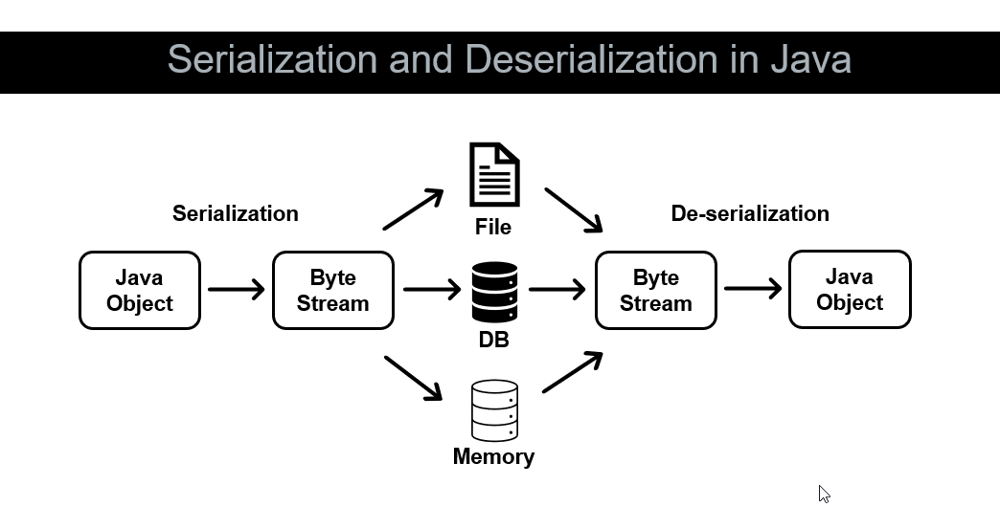

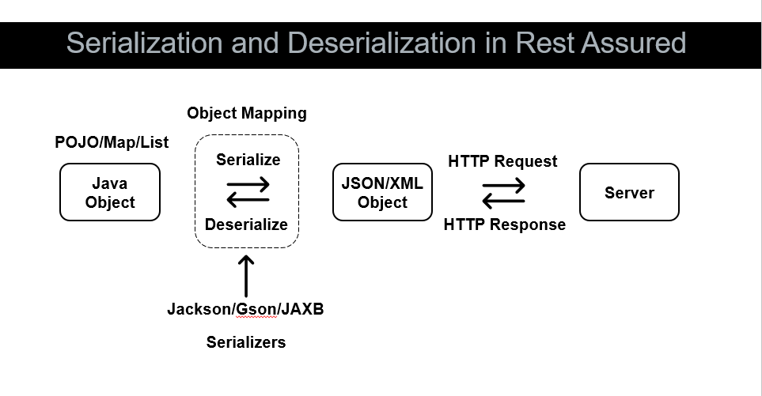

* REST Assured converts the Java object (POJO/Map/List) to JSON/XML with the help of third party libraries such as Jackson, GSON to send
  request to the HTTP Server and to parse the response back to Java Object. This process of serialization and
  deserialization is also called as Object Mapping.
* [Object Mapping Wiki](https://github.com/rest-assured/rest-assured/wiki/Usage#object-mapping)
* REST Assured supports mapping Java objects to and from JSON and XML. For JSON you need to have either Jackson,
  Jackson2, Gson or Johnzon in the classpath and for XML you need Jakarta EE or JAXB.
* We will use the `ObjectMapper` from `jackson.databind` class to serialize Map to JSON object using Jackson. In this case REST assured will not
  perform serialization internally as we are explicitly serializing the Hashmap to String using ObjectMapper from
  Jackson and passing it to request body.
* Code example can be found in `JacksonAPI_JSONObject.class` under practice package:
```java
        HashMap<String, Object> mainObject = new HashMap<String, Object>();

        HashMap<String, String> nestedObject = new HashMap<String, String>();
        nestedObject.put("name", "myThirdWorkspace");
        nestedObject.put("type", "personal");
        nestedObject.put("description", "Rest Assured created this");

        mainObject.put("workspace", nestedObject);

        ObjectMapper objectMapper = new ObjectMapper();
        String mainObjectStr = objectMapper.writeValueAsString(mainObject);

        given().
                body(mainObjectStr).
        when().
                post("/workspaces").
```

* In similar way, the ArrayList can also be serialized to JSON using Jackson ObjectMapper.
* Code example can be found in `JacksonAPI_JSONArray.class` under practice package.
```java
        HashMap<String, String> obj5001 = new HashMap<String, String>();
        obj5001.put("id", "5001");
        obj5001.put("type", "None");

        HashMap<String, String> obj5002 = new HashMap<String, String>();
        obj5002.put("id", "5002");
        obj5002.put("type", "Glazed");

        List<HashMap<String, String>> jsonList = new ArrayList<HashMap<String, String>>();
        jsonList.add(obj5001);
        jsonList.add(obj5002);

        ObjectMapper objectMapper = new ObjectMapper();
        String jsonListStr = objectMapper.writeValueAsString(jsonList);

        given().
                body(jsonListStr).
        when().
                post("/post").
```

* Instead of using the Hashmap, we can create the `ObjectNode` from `ObjectMapper.createObjectNode()` in Jackson and use
  it to serialize to JSON. `ObjectNode` is similiar to Hashmap as it also has `put` method.

```java
        ObjectMapper objectMapper = new ObjectMapper();
        ObjectNode nestedObjectNode = objectMapper.createObjectNode();
        nestedObjectNode.put("name", "myWorkspace3");
        nestedObjectNode.put("type", "personal");
        nestedObjectNode.put("description", "Rest Assured created this");

        ObjectNode mainObjectNode = objectMapper.createObjectNode();
        mainObjectNode.set("workspace", nestedObjectNode);

        String mainObjectStr = objectMapper.writeValueAsString(mainObjectNode);

        given().
                body(mainObjectNode).
```

* Similarly instead of using ArrayList, we can create `ArrayNode` from `ObjectMapper.createArrayNode()` in Jackson to
  serialize arraylist to JSON Array:

```java
        ObjectMapper objectMapper = new ObjectMapper();
        ArrayNode arrayNodeList = objectMapper.createArrayNode();

        ObjectNode obj5001Node = objectMapper.createObjectNode();
        obj5001Node.put("id", "5001");
        obj5001Node.put("type", "None");

        ObjectNode obj5002Node = objectMapper.createObjectNode();
        obj5002Node.put("id", "5002");
        obj5002Node.put("type", "Glazed");

        arrayNodeList.add(obj5001Node);
        arrayNodeList.add(obj5002Node);

        String jsonListStr = objectMapper.writeValueAsString(arrayNodeList);

        given().
                body(jsonListStr).
```
* Apart from Hashmap and Jackson library for serialization, we can also use `POJO` (Plain Old Java Object).
* POJO uses a parameterized constructor for setting values, and we can use getter methods to retrieve the private attributes of class.
* It offers more readability, usability, easy access to data and type safety.
* Lombok is a life saver here that can help to reduce the huge amount of code for getters and setters in POJO classes.
* For simpler cases, POJO can be an overkill.
* Create a POJO for `SimplePojo` and write a test case for serialization and deserialization in `SimplePojoTest`.
* We will use the Jackson to fetch the complete body to write a complete match for whole JSON. This is how the
  deserialization is achieved with jackson. Response can be extracted via `exctract().as(SimplePojo.class)` and save it
  in a new object of the class.
* `readTree()` method will assert for the entire JSON object i.e. entire response body.

```java
        SimplePojo simplePojo = new SimplePojo("value1", "value2");
        SimplePojo deserializePojo =
                given()
                    .body(simplePojo)
                .when()
                    .post("/postSimplejson")
                .then().spec(responseSpecification)
                    .extract().response().as(SimplePojo.class);

        ObjectMapper objectMapper = new ObjectMapper();
        String deserialzedPojoStr = objectMapper.writeValueAsString(deserializePojo);
        String simplePojoStr = objectMapper.writeValueAsString(simplePojo);
        assertThat(objectMapper.readTree(deserialzedPojoStr), equalTo(objectMapper.readTree(simplePojoStr)));
```

* Now we will use POJO classes to reflect the workspaces collection of creating the workspace by making the POST request
  to Postman API.
* First we will create the POJO class for the nested object that contains name, type and description variables.
* Now we will create the POJO class for the main object that contains the key workspace, and the above nested object. It
  will contain the single variable of type `Workspace`
```java
    public class WorkspaceRoot {
    public WorkspaceRoot(){
    }

    public WorkspaceRoot(Workspace workspace){
        this.workspace = workspace;
    }

    public Workspace getWorkspace() {
        return workspace;
    }

    public void setWorkspace(Workspace workspace) {
        this.workspace = workspace;
    }

    Workspace workspace;
}
```

* In the response, we will receive the id of the created workspace so we need to also create a variable for id
  in `Workspace` Pojo so we can deserialize it for assertions.
* Jackson looks for default constructor to perform deserialization,  therefore we add it also in POJO classes.
```java
        Workspace workspace = new Workspace("workspace4", "personal", "random description");
        WorkspaceRoot workspaceRoot = new WorkspaceRoot(workspace);

        WorkspaceRoot deserializedWorkspaceRoot =
            given().
                    body(workspaceRoot).
            when().
                    post("/workspaces").
            then()
                    .spec(responseSpecification)
                    .extract().response().as(WorkspaceRoot.class);

        assertThat(deserializedWorkspaceRoot.getWorkspace().getName(),
                        equalTo(workspaceRoot.getWorkspace().getName()));
        assertThat(deserializedWorkspaceRoot.getWorkspace().getId(),
                        matchesPattern("^[a-z0-9-]{36}$"));
```
* We can use the `@DataProvider` from TestNG to perform different validations and run multiple test cases using same POJO class.
> Note: You need to have at least 1 team workspace in order to create another one. Sorry to disturb you.

* Example solution for the assignment to serialize and deserialize the JSONPlaceholder API using POJO classes is
  in `AssignmentPojoTest.class` where we created 3 nested pojo classes to pass the request and get response in POJO.
```java
    @Test
    public void assignment_serialize_deserialize_test() {

        Geo geo = new Geo("-37.3159", "81.1496");
        Address address = new Address("Kulas Light","Apt. 556","Gwenborough","92998-3874", geo);
        User user = new User("Leanne Graham","Bret","Sincere@april.biz", address);

        User deserializedUser =
                given()
                        .body(user)
                .when()
                        .post("/users")
                .then()
                        .spec(responseSpecification)
                        .extract().response().as(User.class);

        assertThat(deserializedUser.getId(), not(is(emptyOrNullString())));
    }
```

### Jackson Annotations

* Jackson also provides us with certain Annotations. We can set the annotation at class level or property level.
* To ignore the unnecessary fields to be sent to server, these annotations are helpful.
* **Not Null** `@JsonInclude(JsonInclude.Include.NON_NULL)` will ignore the null values from the request body POJO during serialization.
* **Non Default** `@JsonInclude(JsonInclude.Include.NON_DEFAULT)` will ignore the integers as well which are not initialized. Since the default value for integer is
  zero, and the default value for String is Null therefore this annotation will ignore both uninitialized integers and
  string.
* **Non Empty** , specifying only value as `JsonInclude.Include.NON_EMPTY` for a {link java.util.Map} would exclude Maps
  with no values, but would include Maps with `null` values.
* **JSON Ignore** `@JsonIgnore` is an alternative to `@JsonInclude` annotation. It will ignore the property entirely for serialization and deserialization.

```java
    @JsonInclude(JsonInclude.Include.NON_DEFAULT)
    private String i;

    @JsonInclude(JsonInclude.Include.NON_NULL)
    private String id;
    
    @JsonInclude(JsonInclude.Include.NON_EMPTY)
    private HashMap<String, String> myHashMap;
```

* If we use `@JsonIgnore` for the ID property, it will ignore the ID field for both serialization and deserialization.
* But we want ID to be ignored only during serialization, this can be done with another annotation `@JsonIgnoreProperties(value = "id", allowSetters = true)`
* If we want the property during deserialization, we use `allowSetters`
* If we want the property during serialization, we use `allowGetters`

### Complex POJO

* complete code snippet for it can be found in `ComplexPojoTest.java` class under `practice.serializeDeserialize` package, and
  the POJO classes for it can be found in `practice.pojo.collection` package in `src/main/java`
* Let use a complex JSON payload to serialize and deserialize using POJO. We will use  the Postman create Collection API.
* [Postman Create a Collection API](https://www.postman.com/postman/workspace/postman-public-workspace/request/12959542-049042b8-447f-4f71-8b79-ae978cf40a04)
* This will create a collection with 2 items, first item will be the folder with a POST request inside it, and the
  second item will be a GET request.
* JSON payload for request payload:
```json
{
	"collection": {
		"info": {
			"name": "Collection1024",
			"description": "This is just a sample collection.",
			"schema": "https://schema.getpostman.com/json/collection/v2.1.0/collection.json"
		},
		"item": [
			{
				"name": "This is a folder",
				"item": [
					{
						"name": "Sample POST Request",
						"request": {
							"url": "https://postman-echo.com/post",
							"method": "POST",
							"header": [
								{
									"key": "Content-Type",
									"value": "application/json"
								}
							],
							"body": {
								"mode": "raw",
								"raw": "{\"data\": \"123\"}"
							},
							"description": "This is a sample POST Request"
						}
					}
				]
			},
			{
				"name": "Sample GET Request",
				"request": {
					"url": "https://postman-echo/get",
					"method": "GET",
					"description": "This is a sample GET Request"
				}
			}
		]
	}
}
```
* The response body of the postCollection API request will return response body with a following nested hashmap:
```json
{
    "collection": {
        "id": "1d24sfsda459-ca83-406c-bd48-fdsfcdf",
        "name": "Sample Collection",
        "uid": "11427920-1d24a459-ca83-406c-fsdzf-dafb9b852835"
    }
}
```
#### creating POJOs
* Start with a root collection and gradually move down to nested levels.
* Since `item` is an array/list of different types (can be a Folder or Request), we create a List of Objects for this.
* for `Folder`, we can create a separate POJO. It will contain `name`, and `item` ArrayList.
* `Folder` contains `RequestRoot` ArrayList which will contain name, and another nested `Request`.
* Following figure illustrates the POJO classes for Collection Request and Response Payload:

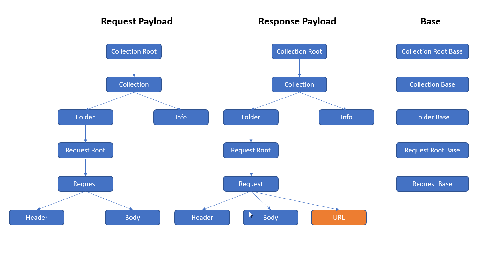

#### Build Payload and Searlize
* We will initialize the POJO classes with a data and then make the Request as follows:
```java
        Header header = new Header("Content-Type", "application/json");
        List<Header> headerList = new ArrayList<Header>();
        headerList.add(header);

        Body body = new Body("raw", "{\"data\": \"123\"}");

        Request request = new Request(
                "https://postman-echo.com/post",
                "POST",
                headerList,
                body,
                "This is a sample Request"
        );

        RequestRoot requestRoot = new RequestRoot("Sample POST Request", request);
        List<RequestRoot> requestRootList = new ArrayList<RequestRoot>();
        requestRootList.add(requestRoot);

        Folder folder = new Folder("This is a folder", requestRootList);
        List<Folder> folderList = new ArrayList<Folder>();
        folderList.add(folder);

        Info info = new Info(
                "Sample Collection1",
                "This is just a sample collection.",
                "https://schema.getpostman.com/json/collection/v2.1.0/collection.json"
        );

        Collection collection = new Collection(info, folderList);

        CollectionRoot collectionRoot = new CollectionRoot(collection);

        given()
                .body(collectionRoot)
                .queryParam("workspace", WORKSPACE_ID)
        .when()
                .post("/collections")
        .then()
                .spec(responseSpecification)
        ;
```
#### De-serialize and Assert Full Body with JSON Assert
* We will deserialize the response body back to POJO.
* As a part of assertion, we will do a full JSON Body comparison. We will make another API call to get the collections
  and then use this response to compare against the collection created with our POST call. In order to get the
  collection detail, we need to get the uid of the collection from GET call to retrieve all Collections.
* The response for `getCollection` is quite similar to the `postCollection` except addition of some extra fields.
* These extra fields must be added to the POJO classes and must be ignored during serialization.
* We will use `@JsonIgnoreProperties(ignoreUnknown = true)` which means that Jackson will ignore any new property in the response that is not in the POJO Classes.
* We get the `url` in the response body but its data type is changed from String to map. As a workarund we change the
  type of url in response to `Object` so whatever the data type will be in response, Jackson will be able to deserialize
  it.
* For making full json body assertion, we need to exclude the URL field since data type is different in the response than the data type in the request.
* Here, `JSONAssert` from `org.skyscreamer` library will be quite useful, as it gives option to exclude certain fields from full json body matching.
* Add the above dependency from maven into POM.xml file
* `JSONAssert` library needs Strings as inputs so we use the `ObjectMapper` to serialize the expected and actual CollectionRoot java objects to the JSON objects (as strings).
```java
        //Create a new Collection and retrieve the UID of the created collection
        String collectionUid = given()
                .body(collectionRoot)
                .queryParam("workspace", WORKSPACE_ID)
        .when()
                .post("/collections")
        .then()
                .spec(responseSpecification)
                .extract()
                .response().path("collection.uid")
        ;

        //Make a GET coll to the collections API with UID of the created collection and deserialize the POJO
        CollectionRoot deserializedCollectionRoot = given()
            .pathParam("collectionUid", collectionUid)
        .when()
            .get("/collections/{collectionUid}")
        .then()
            .spec(responseSpecification)
            .extract()
            .response().as(CollectionRoot.class)
        ;

        //converting the POJO to Json objects (strings) for the JSONAssert
        ObjectMapper objectMapper = new ObjectMapper();
        String collectionRootStr = objectMapper.writeValueAsString(collectionRoot);
        String deserializedCollectionRootStr = objectMapper.writeValueAsString(deserializedCollectionRoot);

        //writing custom Comparator for full JSON Body assertion excluding URL field
        //STRICT mode will also validate for order of the payload and response body, while LENIENT mode will ignore order
        JSONAssert.assertEquals(collectionRootStr, deserializedCollectionRootStr,
                new CustomComparator(JSONCompareMode.STRICT,
                            new Customization("collection.item[*].item[*].request.url", new ValueMatcher<Object>() {
                                public boolean equal(Object o1, Object o2) {
                                    return true;
                                }
                            })
                        )
        );
```

#### Challenges
* We have the following challenges:
  * Different data type for `url` field in payload and response
  * Not asserting the `url` field
* We need separate POJO classes for Request and Response Payload. In Response Payload, we need to create POJO class
  for `URL` becuase it is a JSON object.
```java
{
	"url": {
		"raw": "https://postman-echo.com/post",
		"protocol": "https",
		"host": [
			"postman-echo",
			"com"
		],
		"path": [
			"post"
		]
	}
}
```

* In order to avoid code duplication, we will create `Base` classes and then extend the Request and Response classes
  from it.
* Actual URL is present in the `raw` property of the Response payload inside `URL`, so we need to compare this field
  with the URL in the request payload.

#### Handle Different Data Types in Request and Response
* We will refactor our POJO classes to support the deserialization of the URL field.
* Common fields will be part of Base classes, and the different fields will be present in the child classes for Request and Response.
* We make the `CollectionRoot` Base class to be extract.
* `Info` field will be common for the `Collection` Base class but `Folder` field will be different for request and response because of the URL field.
* `Folder`pojo class have name field in common for request and response, but the `RequestRoot`field is different.
* Similarly, name field is common for `RequestRoot` pojo class, but the `Request` field is different.
* For the `Request` pojo, except for the URL, all other fields are common.
* Now we need to change the data type of URL to String in `RequestRequest` pojo.
* And in the `RequestResponse`the data type of the URL is another POJO class `URL` since it has multiple fields.
* Now in our test case, we will use our POJO Classes that represent the request payload.
* We will also extract the response from GET call to Collections API in `CollectionRootResponse` for storing deserialized response.
* So now we have two objects:
  * `CollectionRootRequest collectionRoot` represents the request payload
  * `CollectionRootResponse deserializedCollectionRoot` represents the response payload


#### Assert Field with Different Data Types
* Now we will extract the URL field and assert it.
* If we look at the response, URL is part of the request, which is part of the request root, which is part of the request Folder.
* Now we might want to create multiple requests at the time of creating collection, so we will have multiple URL fields for each of the request.
* Therefore, we make the data type of the URL to be List so we can store multiple URLs
```java
        List<String> urlRequestList = new ArrayList<>();
        List<String> urlResponseList = new ArrayList<>();

        //Get all the URLs for request payload
        for (RequestRootRequest requestRootRequest: requestRootList) {
            System.out.println("URL from Request Payload: " + requestRootRequest.getRequest().getUrl());
            urlRequestList.add(requestRootRequest.getRequest().getUrl());
        }

        //Get all the URLs for the response body
        List<FolderResponse> folderResponseList = deserializedCollectionRoot.getCollection().getItem();
        for (FolderResponse folderResponse: folderResponseList) {
            List<RequestRootResponse> requestRootResponseList = folderResponse.getItem();
            for (RequestRootResponse requestRootResponse: requestRootResponseList) {
                URL url = requestRootResponse.getRequest().getUrl();
                System.out.println("URL from Response Body: " + url.getRaw());
                urlResponseList.add(url.getRaw());
            }
        }

        //Check that the response URL is present in the request payload
        assertThat(urlResponseList, containsInAnyOrder(urlRequestList.toArray()));
```


#### Automate One More Test Case

* create a new empty collection.
* Since this is an empty collection so we do not need Header, Body, RequestRequest and FolderRequest.
* For the FolderList, we just pass an empty list.
* In this case, the request payload and the JSON response will be similar so we do not need to use JSONAssert to exclude any field.
* With the help of these POJO classes, we can automate scenarios for:
  * Collection with multiple Folders
  * Collection with One Folder and Multiple Requests inside the Folder
  * Collection with only one Request
  * Collection with Request with multiple Headers
  * and so on ....

### Coding Challenges

### Authentication and Authorization

### OAuth Flows

### Google OAuth2.0

### Google OAuth2.0 - Implicit Grant Flow and OpenID Connect

### Google OAuth2.0 - Automate

### Form Based Authentication

### Handling Cookies

---

## Framework

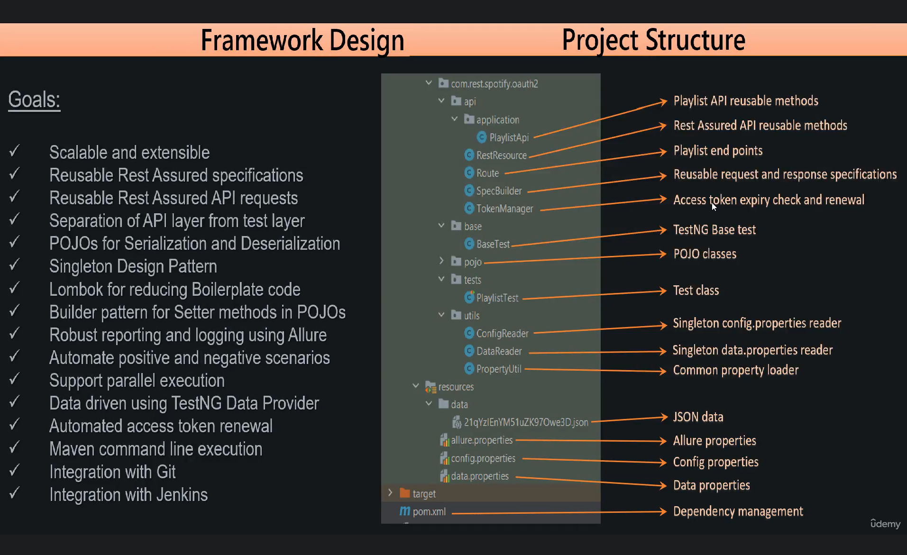


