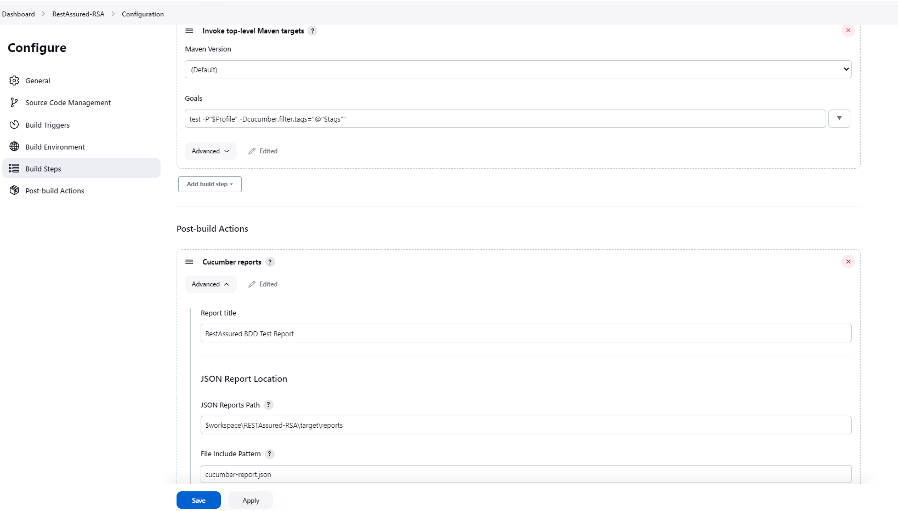
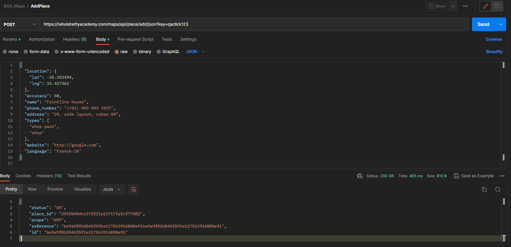
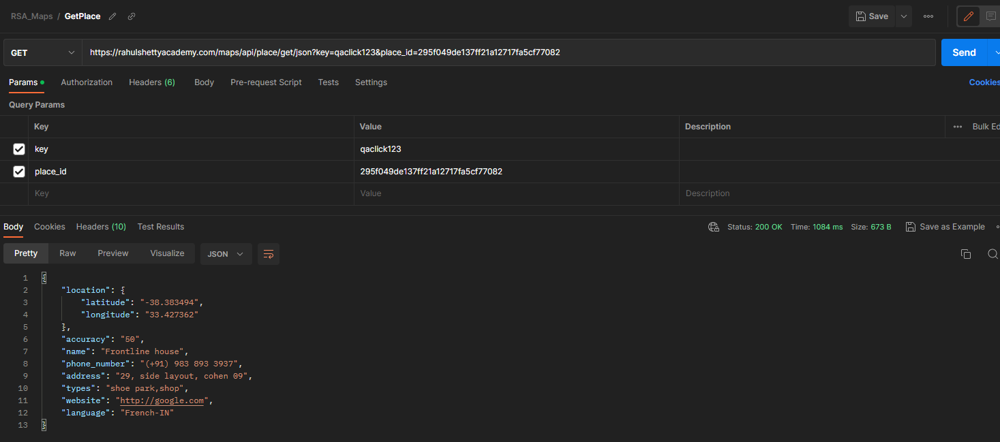
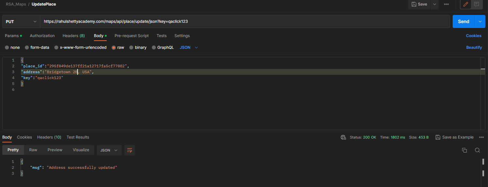
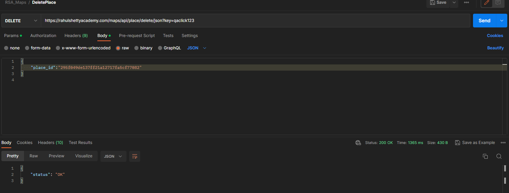
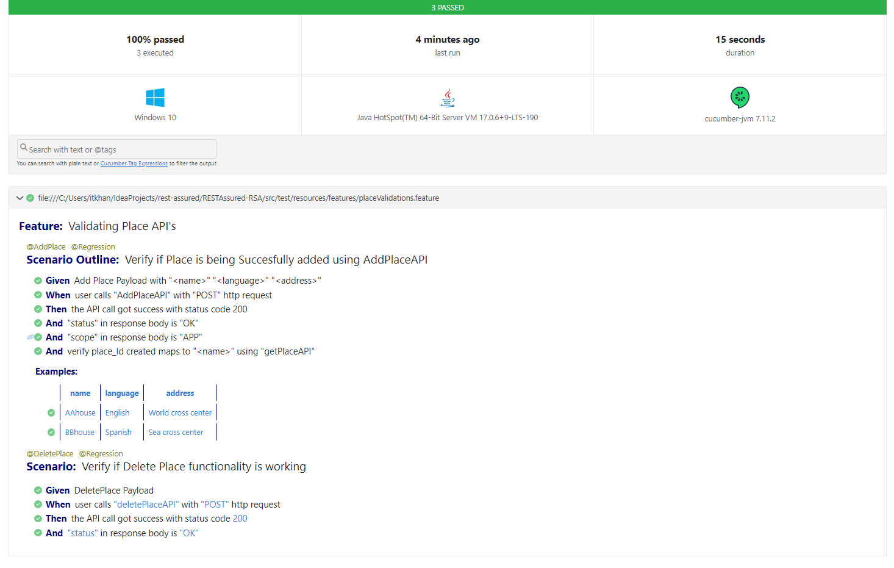
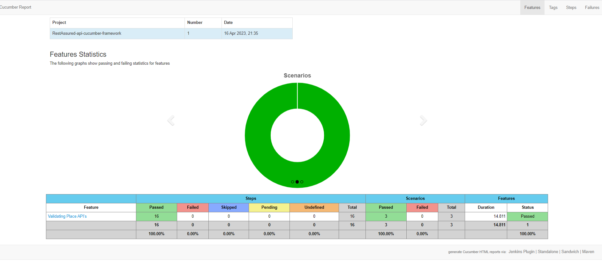
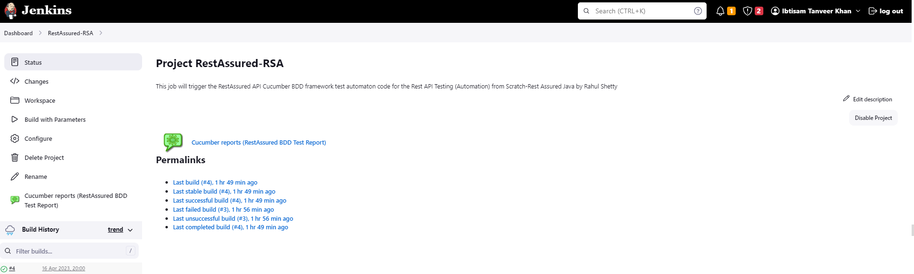

# Rest API Testing (Automation) from Scratch-Rest Assured Java

This repo contains the code for api automation with REST Assured and the framework code. The code is based on the Udemy
course REST API Testing by Rahul Shetty.
[Course Link](https://www.udemy.com/course/rest-api-automation-testing-rest-assured/)

## Libraries

* Java 17
* Rest Assured 5.3.0
* Selenium 4.8
* Cucumber 7.11
* TestNG 7.7
* Cucumber reports 5.7.5

## Learning Outcomes

* What is REST API's?
* Understanding the REST API architecture
* Terminologies such as Endpoint, Resources,Payload,Parameters
* What is POSTMAN?
* How to test API's with Postman?
* Different type of REST requests
* What is REST ASSured?
* Setting up REST ASSURED environment for automation
* Discussion on google API's for automation
* REST Assured methods
* REST Assured validations
* Methods to validate Json and xpath responses
* Optimizing scripts to Framwork standards
* Discussion on JIRA API's
* Discussion on Twitter API's
* Understanding OAUTH authentication
* POJO Classes usage
* Serialization & Deserialization for Json inputs and outputs
* Tons of examples on automating API's with rest assured validations
* Logging feature to log responses
* Migrating project to TESTNG framework
* Building Maven setup as build management tool

## Framework Agenda

* Create Maven project with Cucumber and Rest Assured dependencies
* Define project structure with Cucumber framework setup
* Create Feature file with the test cases to be automated
* Implement step definition files with supported code
* Build Utils file to define all reusable request and response specifications
* Build POJO classes for serializing and deserializing Json payload
* Implement logging into framework to log request and response details
* Develop End-to-End functionality test with all the validations and assertions
* Define global properties and drive all the global variables from properties file
* Define Enum class with constants to centralize all resource details
* Implement data driven mechanism to drive data dynamically from feature files
* Implement parameterization to run tests with multiple data sets using Cucumber Example keyword
* Add more tests and implement tagging mechanism to run selected tests from Test Runner file
* Implement Pre- and Post-conditions for tests with Cucumber Hooks
* Execute complete framework from maven commands
* Implement Maven driven global values into Test for dynamic execution
* Generate Reports for Test Execution Results
* Integrate Framework into Jenkins CI/CD tool
* Implement parameterized Jenkins job to choose the global values at run time

## Running Tests

* `mvn test -Pmaps` will run all the api tests for Google Maps API. The test suite for maps.xml contains the
  BaseRunnerTest which runs all the tests. `maps` profile is created in the pom.xml to choose the profile and run with
  maven surefire plugin.
* `mvn test -Pmaps -Dcucumber.filter.tags="@Regression"` will run the tagged regression tests.
* Tests can also be executed as a part of Jenkins CI by creating a freestyle project and invoke toplevel maven target
  with command `test -P"$Profile" -Dcucumber.filter.tags="@"$tags""`
* A parameterized jenkins job will be triggered to select the tests based on profile and tags choice parameters defined
  in project build configuration.

## API Documentation

* All the documentation and postman collection for different API's tested in the project are documented under folder
  src/test/resources/doc
* Framework is based on the Google Place API where Add Place, Get Place, and Delete Place API is automated.
* Other APIs tested are Google Oauth2, Jira, Ecommerce API and Library API which are implemented in **Practice**
  package.

### Google Maps (Place) API postman

**addPlace**

**getPlace**

**updatePlace**

**deletePlace**

## Reporting

* The cucumber reports are generated under target/reports folder
  

* Masterthought reports are generated under target/cucumber-html-reports.

*  Additionally the masterthought jenkins plugin is also configured to generate the reports in jenkins.

